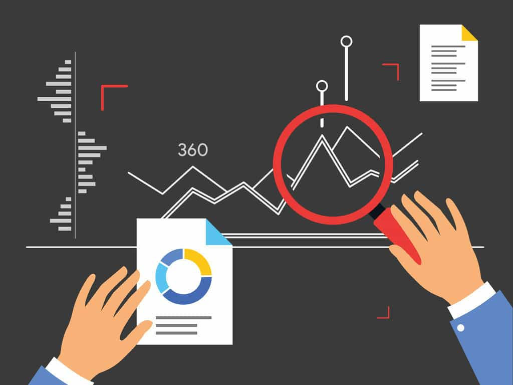

# Welcome to My Data Analysis Portfolio

Hello and welcome to my Portfolio! I’m Kathir, Mater's degree Gradute in Economics and a Data analyst with a passion for turning raw data into meaningful insights. This Page showcases a collection of projects that highlight my expertise in data manipulation, statistical analysis, and visualization.
## Contents
- [About This Portfolio](#about-this-portfolio)
- [Key Technologies](#key-technologies)
- [Project 1: Big Mart Sales Prediction](#project-1-big-mart-sales-prediction)
- [Project 2: COVID-19 Exploratory Data Analysis](#project-2-covid-19-exploratory-data-analysis)
- [Project 3: EPL Match Winner Prediction for 2024-25 Season](#project-3-epl-match-winner-prediction-for-2024-25-season)
- [Project 4: Sales Insights for a Computer Hardware Manufacturer](#project-4-sales-insights-for-a-computer-hardware-manufacturer)
- [Contact](#contact)

  
## About This Portfolio

In this Portfolio, you’ll find a range of projects demonstrating my skills in various aspects of data analysis:

- **Data Cleaning and Transformation:** Projects where I’ve tackled messy datasets, performed data wrangling, and prepared data for analysis.
- **Exploratory Data Analysis (EDA):** In-depth explorations to uncover patterns, trends, and key insights.
- **Statistical Analysis:** Applications of statistical methods to derive insights and support data-driven decision-making.
- **Data Visualization:** Creation of compelling visualizations to effectively communicate findings and support decision-making.
- **Predictive Modeling:** Building and evaluating predictive models to forecast trends and outcomes.

Each project in this page includes detailed descriptions, code link, and where applicable, interactive visualizations or dashboards. You can explore the code, analysis, and visualizations to see the methodologies and techniques used to tackle real-world data challenges.

## Key Technologies

I use a variety of tools and technologies in my data analysis work, including:

- **Python:** Pandas, NumPy, Scikit-learn, Matplotlib, Seaborn, BeautifulSoup
- **R Programming**: ggplot2, dplyr, caret, ivreg
- **SQL:** Data extraction and manipulation
- **Excel:** Advanced formulas, pivot tables, and data visualization
- **Tableau/Power BI:** Interactive dashboards and data visualizations

  
## Project 1: Big Mart Sales Prediction 


## Project Overview
Developed a machine learning model to predict sales for various products across Big Mart outlets, using XGBoost Regressor to address challenges in the retail industry such as inventory management and supply chain optimization.

## Dataset
Utilized Kaggle's Big Mart Sales dataset, which includes product and outlet details such as item weight, visibility, type, MRP, outlet size, location, and establishment year.

## Key Steps
- **Data Collection & Processing:** Loaded the dataset into a Pandas DataFrame for initial analysis.
- **Exploratory Data Analysis:** Conducted EDA using Pandas and Seaborn to check for missing values, and understand numerical and categorical features.
- **Data Pre-Processing:** Handled missing values by filling in the mean for `Item_Weight` and the mode for `Outlet_Size`. Applied label encoding to convert categorical variables to numerical values.
- **Model Training & Evaluation:** Split the dataset into training and testing sets. Trained an XGBoost Regressor model, achieving an R-squared value of 0.64 on training data and 0.59 on testing data.

## Outcome
The model provided reasonable sales predictions with some room for improvement, demonstrating its potential for enhancing inventory management and customer satisfaction.

#### For a more indepth breakdown check out my [Github Page](https://github.com/Kathirrodri17/Portfolio-Projects/edit/main/Bigmart%20sales%20prediction/README.md)

## Project 2: COVID-19 Exploratory Data Analysis  
[Dash Board Link](https://public.tableau.com/views/Covidproject_17226240422510/Dashboard2?:language=en-US&:sid=&:redirect=auth&:display_count=n&:origin=viz_share_link)

This project involves an in-depth exploratory data analysis (EDA) of COVID-19 data using SQL, Excel, and Tableau. The goal was to analyze extensive datasets from multiple countries, clean and prepare the data, and create a comprehensive dashboard to summarize key insights.

## Project Overview
Performed exploratory data analysis of global COVID-19 data to uncover key insights and trends. The analysis focused on infection rates, mortality, and vaccination coverage across different countries and regions, culminating in the creation of an interactive Tableau dashboard.

## Tools and Technologies Used
- **SQL:** Utilized Microsoft SQL Server for querying and initial data analysis.
- **Excel:** Used for data cleaning and preparation.
- **Tableau:** Employed for data visualization and dashboard creation.

## Key Steps
1. **Data Exploration and Findings:** Imported and explored data from the `CovidDeaths` table, including metrics such as total cases, new cases, total deaths, and population by location and date.
   
2. **Analysis of Total Deaths vs. Total Cases in India:** Calculated the death percentage in India to assess the severity of COVID-19 in terms of mortality, comparing it with other regions.

3. **Analysis of Total Cases vs. Population:** Examined the percentage of the population infected by COVID-19 in India to evaluate the extent of the spread and the effectiveness of public health measures.

4. **Countries with Highest Infection Rates:** Identified countries with the highest infection rates relative to their populations, highlighting the most affected regions.

5. **Countries with Highest Death Counts:** Found the countries with the highest total death counts to understand the absolute impact of COVID-19.

6. **Death Counts by Continent:** Analyzed continents with the highest total death counts to identify regional disparities in COVID-19's impact.

7. **Global COVID-19 Metrics:** Summarized global metrics, including total cases, total deaths, and death percentage, providing a macro perspective on the pandemic's impact.

8. **Population vs. Vaccination Coverage:** Explored the correlation between total population and vaccination numbers to assess progress towards achieving herd immunity.

9. **Rolling Vaccination Coverage:** Calculated rolling vaccination coverage over time using a Common Table Expression (CTE) to track the pace of vaccination campaigns.

10. **Temporary Tables for Vaccination Analysis:** Created temporary tables to efficiently analyze and store vaccination coverage data, enabling deeper insights into trends.

## Key Insights
- **Trends Over Time:** Identified significant waves of infections and variations in severity over time.
- **Geographical Distribution:** Highlighted hotspots and regions with different infection and death rates.
- **Comparative Analysis:** Compared the effectiveness of responses across countries and correlated vaccination rates with infection rates.

## Conclusion
This project provides a comprehensive exploratory data analysis of COVID-19, offering valuable insights into global and regional impacts, including infection rates, mortality, and vaccination coverage. The interactive Tableau dashboard visualizes these findings, serving as a tool for understanding the pandemic's effects and supporting informed public health decisions.

For an interactive exploration of the data, visit the COVID-19 Dashboard. To get to know the code and depth of the process check 

## Project 3: EPL Match Winner Prediction for 2024-25 Season


This Project aims to predict the winners of English Premier League (EPL) matches for the 2024-25 season by leveraging historical data from the 2022-2024 seasons to develop a Machine Learning model to predict. The prediction model focuses on determining match winners using various match-related features such as team performance, statistics, and match conditions.

## Project Overview
Developed a prediction model to forecast EPL match outcomes, particularly the winners, using historical data from the 2022-2024 seasons. The model assists fans, analysts, and stakeholders in making informed decisions about upcoming matches.

## Data Scraping
Data was scraped from the English Premier League using HTML extraction from Fbref. The data collection process was carried out in two phases:

1. **Initial Data Scraping:** 
   - Objective: Scrape data for a single EPL team to develop and test the data extraction script.
   - Details: Gathered match data, team statistics, and performance metrics for one team to validate the extraction process.
   - Example: Scraped data for Manchester City to test the script.

2. **Iterative Data Collection:** 
   - Objective: Expand scraping to cover all 20 EPL teams over two seasons (2022-2024).
   - Details: Automated the scraping process to loop through all teams, ensuring comprehensive data collection.
   - Implementation: Introduced a time delay between requests to avoid being blocked by the website.

   Tools used: Beautiful Soup and Pandas for data extraction and transformation into a Pandas DataFrame.

## Data Processing
- **Data Cleaning:** Cleaned and pre-processed the raw data using Pandas to ensure consistency and accuracy.
- **Creating Predictors:** Developed predictor variables for model training.

## Model Building
The prediction model was built using Scikit-Learn with the following classifiers:
- **Decision Tree Classifier**
- **Random Forest Classifier**

The dataset was split into:
- **Training Set:** Data before 01.01.2024
- **Test Set:** Data after 01.01.2024

Initial Results:
- **Overall Match Outcome Prediction Accuracy:** 60%
- **Specific Match Winner Prediction Accuracy:** 47%

## Model Improvement
To improve prediction accuracy, the following steps were taken:
- **Error Analysis:** Identified model errors to guide improvements.
- **Data Enhancement:** Cleaned the data further and added new predictor variables.
- **Model Refinement:** Adjusted the model to enhance performance.

Final Results:
- **Specific Match Winner Prediction Accuracy:** 60%

## Future Work
- Explore additional machine learning algorithms to achieve better prediction accuracy.
- Integrate more detailed player and team statistics.
- Incorporate real-time data updates for more accurate predictions.

## Acknowledgements
- Special thanks to FBref for providing the dataset.
- Appreciation to the Scikit-Learn community for their invaluable machine learning tools.
#### For more detailed breakdown checkout  

## Project 4: Sales Insights for a Computer Hardware Manufacturer


## Project Overview
This project focused on uncovering critical sales insights to support a computer hardware manufacturer's decision-making process. The sales team struggled to access actionable data, so the goal was to provide a clear, data-driven view of their sales performance.

## Technologies Used
- **SQL:** For data exploration and analysis.
- **Power Query:** For data transformation and normalization.
- **Power BI:** For data visualization and dashboard creation.

## Key Components

### 1. Data Analysis Using SQL
Conducted exploratory data analysis (EDA) to extract valuable insights from the sales data. Key SQL queries included:

- Extracting customer records and transactions for specific markets.
- Analyzing sales trends by currency and year.
- Calculating total revenue by year, month, and market.

**Example SQL Queries:**
```sql
-- Show all customer records
SELECT * FROM customers;

-- Show total revenue in Chennai in 2020
SELECT SUM(transactions.sales_amount) 
FROM transactions 
INNER JOIN date 
ON transactions.order_date = date.date 
WHERE date.year = 2020 AND transactions.market_code = 'Mark001';
```
### 2. Data Transformation with Power Query
Transformed and normalized the data to ensure consistency, enabling accurate analysis. A custom formula was applied to convert all sales amounts to a single currency.

Custom Formula:
```= Table.AddColumn(#"Filtered Rows", "normalised_amount", each if [currency] = "USD" or [currency] = "USD#(cr)" then [sales_amount] * 75 else [sales_amount])```

### 3. Dashboard Creation with Power BI
Established relationships between tables in Power BI to enable seamless analysis across multiple data sources. Developed an interactive dashboard that visualizes sales performance across different dimensions, empowering the sales team to make informed decisions.
#### Key Insights


#### Performance Insights


#### Profit Analysis


### 4. Key Insights

Performance Insights: Identified sales trends and key performance indicators (KPIs) across different markets and currencies.
Profit Analysis: Analyzed profitability across different product lines and regions.
Conclusion
This project successfully addressed the challenge of unlocking hidden sales insights for a computer hardware manufacturer. By leveraging SQL for in-depth data analysis, Power Query for data transformation, and Power BI for data modeling and visualization, the sales team gained access to a comprehensive dashboard that enables informed, data-driven decisions. The integration of these tools not only streamlined the analysis process but also provided valuable insights that were previously inaccessible, ultimately contributing to better strategic planning and improved business outcomes.
Indepth project breakdown on

## Contact

If you have any questions or feedback, don’t hesitate to reach out. You can connect with me on [LinkedIn](https://www.linkedin.com/in/kathir-jm/) for more about my professional journey and other work.

Thank you for visiting my portfolio. I hope you find the projects interesting and insightful!

---

J.M.Kathir  
[LinkedIn](https://www.linkedin.com/in/kathir-jm/) |  [kathirrodriguez@gmail,com](kathirrodriguez@gmail.com) | [Github](https://github.com/Kathirrodri17/Portfolio-Projects/blob/main/README.md)

